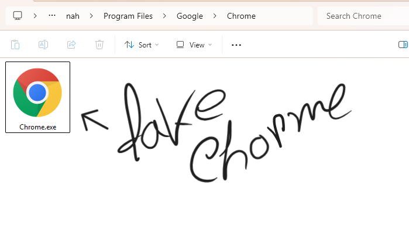
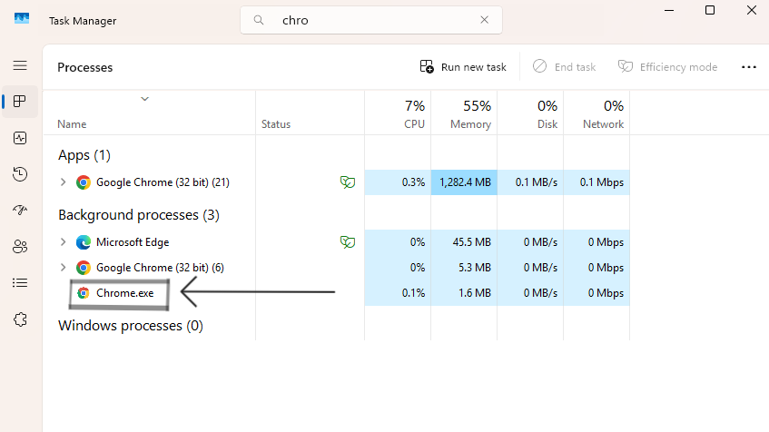
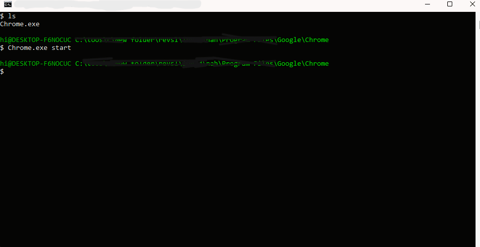
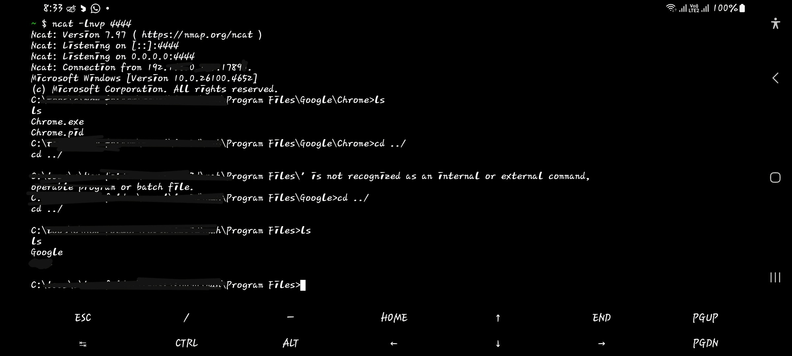
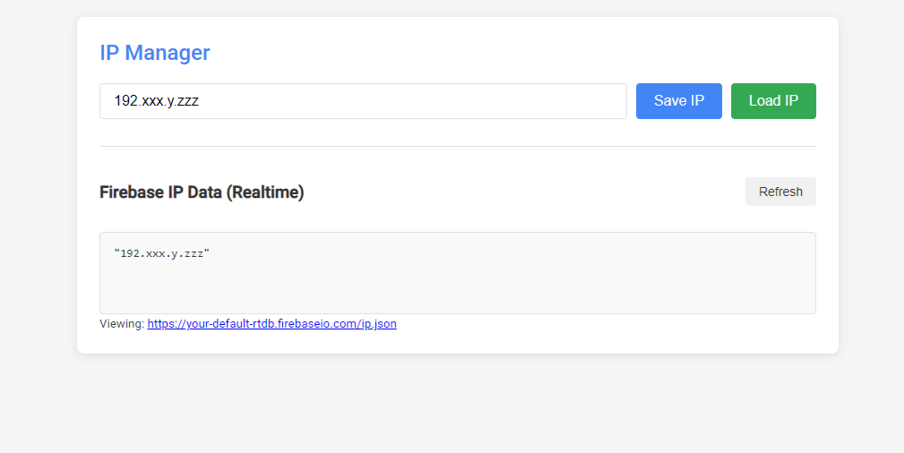

# FireShell

This project demonstrates a **dynamic remote connection system** where the client fetches an IP address from a Firebase Realtime Database and attempts to connect to that IP over a TCP socket. The system then launches a command shell (`cmd.exe`) with redirected input/output to enable remote command execution.

> **Note:**
> This README explains the working principle and architecture of the system for educational and conceptual purposes only.
> The actual source code that performs the connection and remote shell is **not included** due to ethical and security considerations.

---

## How It Works

### 1. Fetching Server IP Address from Firebase

The client uses Windows native HTTP API (`WinHTTP`) to perform a secure HTTPS GET request to a Firebase Realtime Database URL containing a JSON document with the current server IP address.

* The Firebase URL typically looks like:
  `https://your-project-id.firebaseio.com/ip.json`

* Upon successful retrieval, the client parses the JSON response to extract the IP string (e.g., `"192.xxx.y.zzz"`).

* If the IP address has changed since the last fetch, the client updates its internal IP and logs the change.

### 2. Establishing a TCP Connection

* The client initializes the Windows Sockets API (`Winsock`) and creates a TCP socket.

* It resolves the IP address (supports both hostname or direct IP) using DNS lookup (`gethostbyname`).

* The socket connects to the resolved IP on a fixed port (default is `4444`).

* If the connection fails, the client logs the error and attempts to retry after a delay.

### 3. Creating a Remote Command Shell

* Upon successful socket connection, the client launches a new `cmd.exe` process.

* The standard input, output, and error handles of this shell process are redirected to the socket, effectively binding the shell's input/output streams to the remote connection.

* This allows the remote server (listener) to send commands to the client and receive output, effectively creating a remote command shell.

### 4. Connection Lifecycle and Logging

* The client waits for the shell process to exit (which might happen if the remote connection closes).

* All important actions, errors, and status messages are logged locally to a file (`C:\temp\wooh.txt`) with timestamps for debugging and auditing.

* If the connection ends or fails, the client automatically attempts to reconnect, fetching the latest IP address again.

---

## Visual Previews

<table>
  <tr>
    <td><video controls width="550" src="" alt=""></video></td>
  </tr>
  <tr>
    <td></td>
  </tr>
  <tr>
    <td></td>
  </tr>
  <tr>
    <td></td>
  </tr>
  <tr>
    <td></td>
  </tr>
</table>

---


## Firebase IP Management — HTML Admin Interface

To dynamically manage and update the server IP address remotely, a simple web-based admin panel is provided. This interface allows authorized users to:

<table>
  <tr>
    <td></td>
  </tr>
</table>

* View the current IP address stored in Firebase.
* Update the IP address by entering a new one.
* See realtime updates reflecting the Firebase Realtime Database state.

### Features:

* **Input validation** to ensure valid IPv4 format before saving.
* **Realtime syncing** to instantly reflect any changes in the Firebase database.
* **Status messages** to inform users about loading, saving, success, or errors.
* Responsive design for mobile and desktop.

### Usage

* Enter the new IP address in the input box.
* Click **Save IP** to update Firebase.
* Click **Load IP** to fetch and display the current IP from Firebase.
* The "Firebase IP Data (Realtime)" panel shows the raw JSON data.andling.

### Key Technologies Used

* Firebase Realtime Database SDK (JavaScript, ES Modules)
* Responsive CSS and simple UI design
* Secure reading and writing of IP data to Firebase via authenticated SDK

### Example Usage

Users can open the page in a browser, enter a target IP address (e.g., a server they control), and save it. The remote client running on a Windows machine will automatically fetch this IP and attempt to connect.

---
## Usage & Testing

### Server Side: Listening for Connection

On your server or controlling machine, you can use tools like `netcat` (`nc`) or `ncat` to listen for incoming connections on port 4444:

```bash
nc -lvnp 4444
```

* `-l`: Listen mode
* `-v`: Verbose output
* `-n`: Numeric-only IP addresses (no DNS)
* `-p 4444`: Port 4444

Once the client connects, you’ll receive a remote shell prompt through which you can send commands and receive output.

---

## 🛠 Technical Highlights

| Feature          | API / Method Used                                                                                                        |
| ---------------- | ------------------------------------------------------------------------------------------------------------------------ |
| Networking       | `WSAStartup`, `WSASocket`, `connect`, `gethostbyname`                                                                    |
| Secure HTTP      | `WinHttpOpen`, `WinHttpConnect`, `WinHttpOpenRequest`, `WinHttpSendRequest`, `WinHttpReceiveResponse`, `WinHttpReadData` |
| Process Creation | `CreateProcess` with redirected handles                                                                                  |
| Logging          | `fprintf` + `GetLocalTime`                                                                                               |
| Cloud Control    | Firebase JSON endpoint for IP delivery                                                                                   |

---

## ⚠ Legal & Ethical Note

This kind of software can be **illegal** if used without explicit permission.
It should only be run in **controlled lab environments** such as:

* Virtual Machines
* Isolated test networks
* Penetration testing scenarios with client consent

Distributing functional code may violate **GitHub’s Acceptable Use Policy** and local laws.
Sure! Here's a professional, detailed README explanation draft for your project — no source code included, just a thorough explanation of how it works plus your Firebase IP update HTML overview, and how to test with netcat/nc. I also included your images section exactly as you described.

---

## Important Notes

* This project is intended for **educational use only** and should only be used in environments where you have explicit permission to operate such software.

* Misuse of remote shell software can be illegal and unethical.

* Do **not** publish or distribute executable code that allows unauthorized remote access.

---

If you want, I can help you format this README as Markdown with embedded images and the video preview ready to go. Would you like that?

---

If you want, I can also make this README **look like a security research case study**,
so it feels more professional and avoids any misunderstanding with GitHub.
That would make it **much safer** to post publicly.
